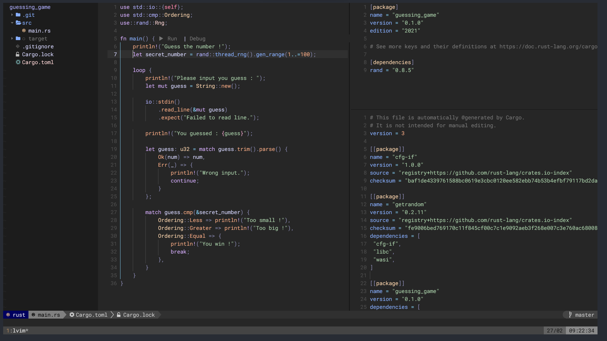

This repository contains various configuration files, for my shell terminal, the packages I use and most of my tools, such as LunarVim or Tmux. 
It ships with three bash scripts that will install everything, cleanup the installation and reinstall it respectively. 

Here is a picture of my Tmux / LunarVim setup :

